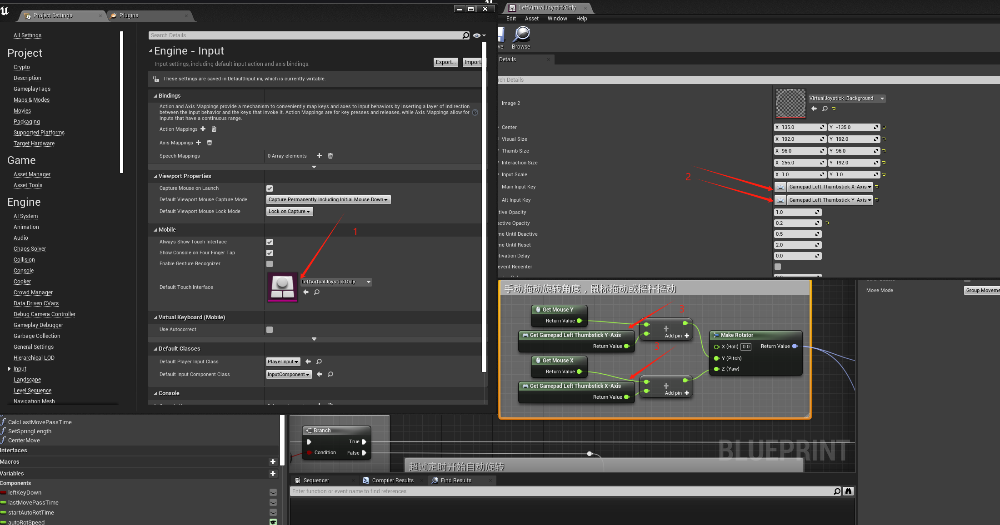
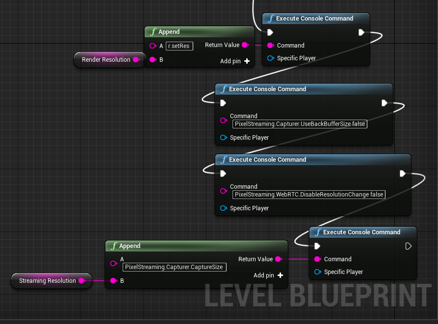
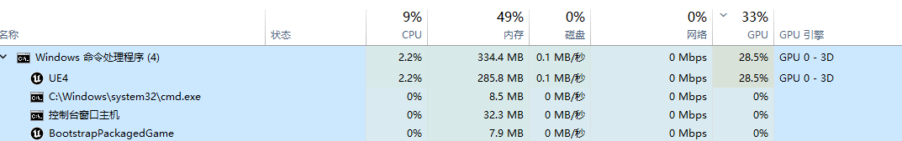

# UE像素流推流部署文档

## 0.官方文档

### UE5.1

虚幻引擎像素流送入门 <https://dev.epicgames.com/documentation/zh-cn/unreal-engine/getting-started-with-pixel-streaming-in-unreal-engine?application_version=5.1>  
创建主机和网络连接指南 <https://dev.epicgames.com/documentation/zh-cn/unreal-engine/hosting-and-networking-guide-for-pixel-streaming-in-unreal-engine?application_version=5.1>  
像素流参考 <https://dev.epicgames.com/documentation/zh-cn/unreal-engine/unreal-engine-pixel-streaming-reference?application_version=5.1>  

### UE4.27

像素流送入门 <https://docs.unrealengine.com/4.26/zh-CN/SharingAndReleasing/PixelStreaming/PixelStreamingIntro/>  
创建主机和网络连接指南 <https://docs.unrealengine.com/4.27/zh-CN/SharingAndReleasing/PixelStreaming/Hosting/>  
像素流参考 <https://docs.unrealengine.com/4.27/zh-CN/SharingAndReleasing/PixelStreaming/PixelStreamingReference/>  

## 1.UE插件安装与基础配置

## 1.1 安装

在Edit->Plugins里，搜索并安装"**Pixel Streaming**"像素流插件，勾选Enable。重启UE后，即安装好了像素流插件。

>**特别的**  
>如果有需要使用虚拟摇杆的程序，特别是需要适配手机端的应用时，需要在Edlt->Project Setting->Engine->Input->Moblie中，勾选Always Show Touch Interface以显示虚拟摇杆。并根据项目需求设置Default Touch Interface调用的Touch Interface Setup，默认为左右双摇杆，部分项目仅需要单个摇杆以控制转向，因此不需要右摇杆，使用LeftVirtualJoystickOnly即可。  
>当用户使用虚拟摇杆控制时，需要在原本进行电脑键鼠的操作的地方加入上述使用的Touch Interface Setup中对应的Input Key输入，例如默认的Gamepad Left Thumbstick X-Axis。  


## 1.2 设置渲染和推流的分辨率

可以直接按"~"输入控制台指令，或在蓝图中使用```Execute Console Command```节点以输入控制台指令，```从Event Begin Play```节点接入以调用。更推荐后者，因为更方便后续调整。  
  
按顺序输入指令  
```r.SetRes 1920x1080```：调整渲染分辨率，以{width}x{height}的形式；  
```PixelStreaming.Capturer.UseBackBufferSize false```：编码器使用后台缓冲区大小  
```PixelStreaming.WebRTC.DisableResolutionChange false```：允许调整像素流分辨率；  
```PixelStreaming.Capturer.CaptureSize 1920x1080```：调整视频流分辨率，以{width}x{height}的形式。  
一般而言，渲染分辨率应当大于等于视频流分辨率。降低视频流分辨率可以监督网络传输所需网速。  
当然，即便蓝图里已经记录了，也只是启动时会被配置，后续可以再在控制台中配置

## 1.3 打包

后续，按正常流程打包程序，*(UE4.27)* File->Package Project->Windows(64-bit) / *(UE5.1)* Files->Package Project ->Windows ->Windows(64-bit)，得到打包好的文件

## 2.最基础的测试

### 2.1 安装像素流信令服务器SignallingWebServer

#### UE4

**[WARNING] 这里在后续更新文档时没有测试过，可能存在故障**  
运行下述文件以安装信令服务器:  
> *(UE4)* .\Samples\PixelStreaming\WebServers\SignallingWebServer\platform_scripts\cmd\setup.ps1

#### UE5
先获取像素流的服务相关包：
> *(UE5)* .\项目名\Samples\PixelStreaming\WebServers\get_ps_servers.bat
运行下述文件以安装信令服务器:  
> *(UE5)* .\项目名\Samples\PixelStreaming\WebServers\SignallingWebServer\platform_scripts\cmd\setup.bat  

安装完成后，可以调用与上述文件同文件夹中的```Start_SignallingServer.ps1```以启动像素流服务器。  
为了方便后续调用并修改参数，建议编写cmd脚本打开该文件。在游戏启动程序同文件夹下新建文件 ```Run_Start_SignallingServer.bat```，以UE5为例：  


``` cmd
@echo off
powershell -ExecutionPolicy Bypass -File ".\[ProjectName]\Samples\PixelStreaming\WebServers\SignallingWebServer\platform_scripts\cmd\Start_SignallingServer.ps1"
pause

```

运行后，有如下效果


### 2.2 配置游戏主程序的运行参数

虽然可以以创建快捷方式的方式添加参数，但是更推荐编写cmd脚本，更方便扩展。在游戏启动程序同文件夹下新建文件```StartGame.bat```  

``` batch
: StartGame.bat
ProjectName.exe -PixelStreamingIP=127.0.0.1 -PixelStreamingPort=8888
```

一般的，在非调试时，需要在```StartGame.bat```中继续添加参数```-RenderOffscreen```，以不显示游戏运行的窗口，即

``` batch
: StartGame.bat
ProjectName.exe -PixelStreamingIP=127.0.0.1 -PixelStreamingPort=8888 -RenderOffscreen
```  

### 2.3 测试运行

* **1.启动```StartSignallingWebServer.ps1```**  
等待出现  

``` bat
16:26:59.132 WebSocket listening to Streamer connections on : 8888
16:26:59.132 WebSocket listening to Players connections on : 80
16:26:59.133 Http listening on *: 80
```

即为像素流服务器启动成功。  

* **2.启动```StartGame.bat```**。  
当未添加```-RenderOffscreen```参数时，会直接打开游戏窗口；当添加了```-RenderOffscreen```参数时，不会出现游戏运行窗口，但是打开任务管理器可以看见该程序占用GPU资源较高。  
  
即为游戏程序启动成功  

* **3.网页访问**  

在运行像素流渲染的主机上打开浏览器，输入链接```127.0.0.1```（或```127.0.0.1:80```也可）即可在网页获得渲染到的画面。  
在**同一局域网中**其他设备要访问像素流画面时，需要获得像素流渲染的主机的ip。  
在渲染主机中，按```Win+R```输入```cmd```打开命令提示符，输入```ipconfig```获得渲染主机的IPv4 地址，或在"控制面板->网络和 Internet->网络连接"中找到正在使用中的网络连接，"右键->状态->详细信息->IPv4地址"，获得渲染主机的IP地址。  
其他设备的网页中输入渲染主机的IP地址，例如```172.16.124.153```或```172.16.124.153:80```，即可在网页获得渲染到的画面。  

## 3.一主机对多用户

**官方文档：<https://docs.unrealengine.com/4.27/zh-CN/SharingAndReleasing/PixelStreaming/Hosting/>，参看“配对时的多个完整堆栈”部分**  

上面的基础测试环境，仅能支持1台渲染主机渲染1个画面，多用户同时访问时会显示同一个画面内容，并且同时接收用户输入，这是不合适的。实际使用时，需要只部署一台高图形性能的渲染主机，即可带动多个显示客户端，一般仅推荐一张4080级别的显卡带动最多3个客户端，下面以2个客户端为例。  

### 3.1.安装配对服务器MatchMaker  

MatchMaker服务器启动路径在：  
> *(UE4)* .\Samples\PixelStreaming\WebServers\Matchmaker\run.bat  
> *(UE4)* .\项目名\Samples\PixelStreaming\WebServers\Matchmaker\run.bat  

同样的，建议在游戏启动程序同文件夹下新建文件```StartMatchMakerServer.ps1```以快速启动配对服务器  

```powershell
# StartMatchMakerServer.ps1
Samples\PixelStreaming\WebServers\Matchmaker\run.bat
```

启动时可附带参数
|参数|必须性与值|描述|
|--|--|--|
|--httpPort \<value>|非必须，默认90|定义配对服务器聆听传入HTTP连接（来自浏览器）所用的端口。|
|--matchmakerPort \<value>|非必须，默认9999|定义配对服务器聆听传入状态消息（来自信令和Web服务器）所用的端口。|

添加参数后的样例

```powershell
# StartMatchMakerServer.ps1
Samples\PixelStreaming\WebServers\Matchmaker\run.bat --httpPort 90 --matchmakerPort 9999
```

运行后，出现类似下述输出，即为启动成功

``` batch
11:30:51.827 HTTP listening on *:90
11:30:51.827 Matchmaker listening on *:9999
```

### 3.2.配置信令服务器和游戏主程序的运行参数  

#### 3.2.1.复制启动文件

复制并重命名```StartGame.bat```为```StartGame1.bat```、```StartGame2.bat```；复制并重命名```StartSignallingServer.ps1```为```StartSignallingServer1.ps1```、```StartSignallingServer2.ps1```。  

#### 3.2.2.配置StartMatchMakerServer1/2.ps1

|参数|必须性与值|描述|
|-|-|-|
|--UseMatchmaker \<value>|必须，```true```|将此参数设为 true，以便信令和Web服务器向配对服务器发送自身当前状态。|
|--matchmakerAddress \<value>|非必须，```localhost```|将与该信令和Web服务器连接的配对服务器IP地址。|
|--matchmakerPort \<value>|必须，**<p style="color:red">与```StartMatchMakerServer.ps1```的```--matchmakerPort```参数值相同</p>**|该信令和网络服务器需要向配对服务器发送消息时所用的端口。请确保此数值与配对服务器所设的 --matchmakerPort 值相匹配。|
|--publicIp \<value>|非必须，```localhost```|信令和Web服务器的公开可见IP地址。配对服务器将用户重新指定到该信令和Web服务器时，其会把它们发送到该IP地址。因此，其必须对连接浏览器可见。|
|--httpPort \<value>|必须，为未被占用的端口，默认80，**<p style="color:red">不可重复</p>**|信令和Web服务器聆听HTTP连接所用的端口。配对服务器将用户重新指定到该信令和Web服务器时，其会把它们发送到该端口。|
|--StreamerPort \<value>|必须，为未被占用的端口，默认8888，**<p style="color:red">不可重复</p>**|信令和Web服务器侦听来自虚幻引擎应用程序的传入连接的端口。|

添加参数后的样例

``` powershell
# StartSignallingWebServer1.ps1
Samples\PixelStreaming\WebServers\SignallingWebServer\platform_scripts\cmd\Start_SignallingServer.ps1 --StreamerPort 8892 --httpPort 83 --UseMatchmaker true --matchmakerAddress localhost --matchmakerPort 9999
```

#### 3.2.3.配置StartGame1/2.bat

|参数|必须性与值|描述|
|-|-|-|
|-PixelStreamingIP=\<value>|必须，```localhost```|指定运行信令和Web服务器的计算机的IP地址或域名。|
|-PixelStreamingPort=\<value>|必须，**<p style="color:red">与对应的```StartSignallingWebServer.ps1```的```StreamerPort```相同，不可重复</p>**<br>每个StartGame对应1个StartSignallingWebServer|指定信令和Web服务器侦听来自虚幻引擎应用程序的传入通信的端口。信令和Web服务器使用默认值 8888 。|
|-RenderOffscreen| 非必须，但是推荐加入此参数 |自动运行虚幻引擎应用程序，在本地计算机上完全没有可见的渲染。该应用程序不会显示窗口，也不会全屏渲染。 你可以将此参数与-ForceRes结合使用，以便阻止虚幻引擎根据主显示器的分辨率自动调整分辨率。<br>如果省略此参数，虚幻引擎应用程序窗口将正常渲染。如果此应用程序窗口最小化，像素流视频和输入捕获将停止工作。因此，我们建议始终包含此参数，除非你需要在运行时在同一台计算机上本地查看虚幻引擎应用程序的渲染输出。|
|-ForceRes| 非必须 |当与-ResX和-ResY结合使用时，这将强制虚幻引擎达到指定的分辨率。这在通常没有显示分辨率的云部署中很有用。|
|-ResX \<value>| 非必须，但有```-ForceRes```参数时必须 |设置虚幻引擎应用程序启动时分辨率的宽度分量。|
|-ResY \<value>| 非必须，但有```-ForceRes```参数时必须 |设置虚幻引擎应用程序启动时分辨率的高度分量。|
|-AudioMixer| 非必须，但是推荐加入此参数 |强制虚幻引擎将软件混合用于音频，如果没有音频设备，这可能是必需操作……|

``` batch
: StartGame1.bat
ProjectName.exe -PixelStreamingIP=127.0.0.1 -PixelStreamingPort=8888 -RenderOffscreen -ResX 2560 -ResY 1440 -ForceRes
```  

## 3.3.启动流程与优化启动流程

推荐启动顺序：```StartMatchMakerServer.ps1->StartSignallingWebServer1/2.ps1->StartGame1/2.bat```。虽然启动顺序并无影响，但是建议按顺序逐个启动，以避免出错或方便debug  
当然，也可以使用脚本进行统一启动管理
<details>  
<summary>统一启动管理python脚本</summary> 

``` python
# StartAll.py

import subprocess  
  
def run_powershell_script(script_path, expected_output):  
    proc = subprocess.Popen(["powershell.exe", "-ExecutionPolicy", "Bypass", "-File", script_path],  
                            stdout=subprocess.PIPE, stderr=subprocess.PIPE, universal_newlines=True)  
      
    while True:  
        line = proc.stdout.readline()  
        if not line:  
            break  
        print(line.strip())  
        if expected_output in line:  
            print(f"===========================Running '{script_path}'  Found '{expected_output}', continuing...===========================")  
            return  
  
    # 如果PowerShell脚本正常结束但没有找到预期输出，则抛出异常  
    proc.wait(timeout=1)  # 等待一小段时间以确保没有遗漏输出  
    if proc.returncode != 0:  
        raise subprocess.CalledProcessError(proc.returncode, script_path)  
    else:  
        raise ValueError(f"Did not find '{expected_output}' in the output of {script_path}")  
  
def run_batch_file(batch_path, expected_output):  
    proc = subprocess.Popen(batch_path, stdout=subprocess.PIPE, stderr=subprocess.PIPE, universal_newlines=True)  
      
    # 类似于PowerShell脚本的处理逻辑  
    while True:  
        line = proc.stdout.readline()  
        if not line:  
            break  
        print(line.strip())  
        if expected_output in line:  
            print(f"===========================Running '{batch_path}'  Found '{expected_output}', continuing...===========================")  
            return  
  
    # 如果批处理文件正常结束但没有找到预期输出，则抛出异常  
    proc.wait(timeout=1)  # 等待一小段时间以确保没有遗漏输出  
    if proc.returncode != 0:  
        raise subprocess.CalledProcessError(proc.returncode, batch_path)  
    else:  
        raise ValueError(f"Did not find '{expected_output}' in the output of {batch_path}")  
  
# 运行PowerShell脚本，直到出现"Matchmaker listening on"  
run_powershell_script("StartMatchMakerServer.ps1", "Matchmaker listening on")  
  
# 运行两个Signalling Server的PowerShell脚本  
run_powershell_script("StartSignallingServer1.ps1", "Http listening on")  
run_powershell_script("StartSignallingServer2.ps1", "Http listening on")  
  
# 运行两个游戏批处理文件  
run_batch_file("StartGame1.bat", "")  # 替换为你期望的输出  
run_batch_file("StartGame2.bat", "")  # 替换为你期望的输出  
  
print("All servers and games started successfully.")
```

</details>
